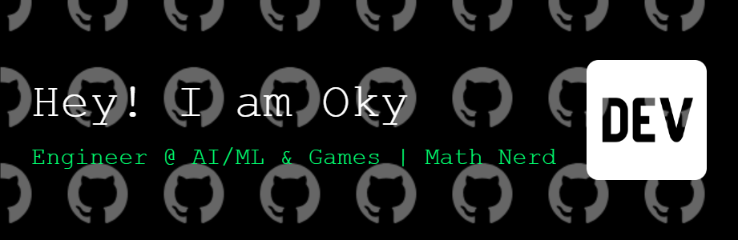

  

<h1 align="center">Welcome 👋</h1>

## 👨‍💻 About Me

Hi! I'm **Oky** :).

**Developer & Engineer.**

---

## 🧠 Skills & Technologies

  

 

  

 

  

 

  
  
  
  

 

  

 

  
  
  

 

  

 

  
  
  
  
  
  

 

---

## 📬 Let's Connect!

Feel free to reach out if you'd like to **collaborate** or just want to say hi!

---

