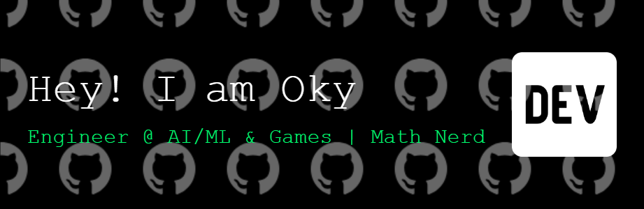

  

<h1 align="center">Hi, I'm Oky 👋</h1>

  <b>Master's Student in Artificial Intelligence · B.Sc. Mathematics</b>

## 👨‍💻 About Me

I'm a software engineer with professional experience in game development, currently pursuing a Master's degree in Artificial Intelligence at Syiah Kuala University.

---

**Frequently used:** Python · TypeScript · C# · Luau · TensorFlow · NodeJS · SQL · Docker

---

## 📬 Let's Connect!

Feel free to reach out if you'd like to **collaborate** or just want to say hi!

---

