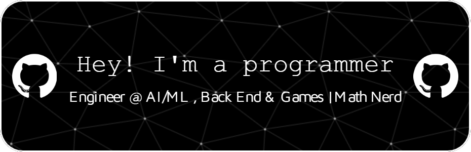

  

<h1 align="center">Welcome 👋</h1>

## 👨‍💻 About Me

Hi! I'm **Oky**:).

I mainly work with **C#**, **C++**, and **Python**, while also having experience with **Lua**, **Java**, and **JavaScript**.

I'm drawn to these fields because I enjoy solving complex problems, building systems, and exploring tech.

---

## 🧠 Skills & Technologies

  

  
  
  
  
  
  
  
  
  
  
  
  
  
  

 

---

## 📬 Let's Connect!

Feel free to reach out if you'd like to **collaborate** or just want to say hi!

---

